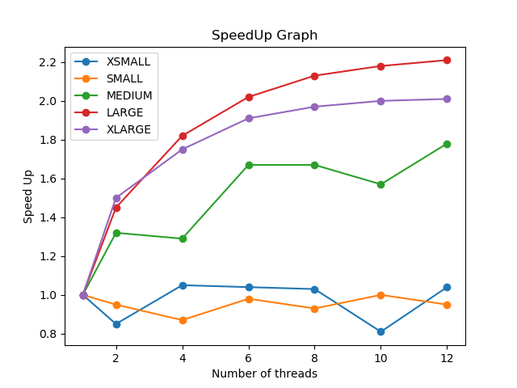

# Twitter Server Client

This code implements a data structure that represents a user's feed. Then, requests are received from the Client in JSON format and those are processed parallely. The image below illustrates the client server model used.

### Functionalities of different codes

**Feed.go** – This program implements the twitter feed algorithm basis the conditions provided. The locks system used for implementation is coarse grained. The head here is not a blank node, but the first node. The methods provided by the feed class are Add, contains, remove and ge@eed. The add, contains and remove methods add a post to a feed, check if a post is in the feed and remove a post from the feed respectively. The ge@eed method gives a list of all the posts in the feed based on the timestamp of the posts.  
**Server.go** – This program receives config from the twitter function. Based on the mode in config, it runs the code either for parallel or serial. For the serial function, each command is first decoded and then encoded back. For the parallel version, the main thread encodes all the commands and the threads spawned have the duty to decode them. The main function does sema.up till all the waiting threads are done and then returns.  
**Twitter.go** – This program takes input from the user and based on the number of arguments given by the user, calls server for parallel execution or serial execution. If the number of arguments are incorrect, the code will produce an error.  

### Code for running the testing script: 

sbatch benchmark.sh
in the benchmark folder

### Observations

The performance of coarse-grained linked list does not improve significantly with the increase in the number of threads. Changing it to lock free or lazy implementation would significantly improve the performance because multiple threads can add/remove at the same time from the list in that case, which is not there in coarse grained linked list.  
The lock, queue are already the most optimized versions of themselves. However, changing the linked list from coarse grained to say the lock free would significantly enhance the performance. Also, if instead of a single producer, there are multiple producers and multiple consumers, that might also enhance the performance.  
Below is the graph generated by the python script. We notice a couple of things here:  
* As the size of the problem increases, we start seeing some speedup. This is because, when the size of the problem is small, many threads are waiting redundantly for work. As the tasks increase, the efficiency enhances because many threads can now run in parallel and get the work done.
* The speed up isn’t very significant. Even for larger problem size, it saturates to a value of around 2. This is because of the coarse-grained lock algorithm used. At a time, only a single thread is allowed to modify feed, which results in considerable slowness despite the large number of threads.

